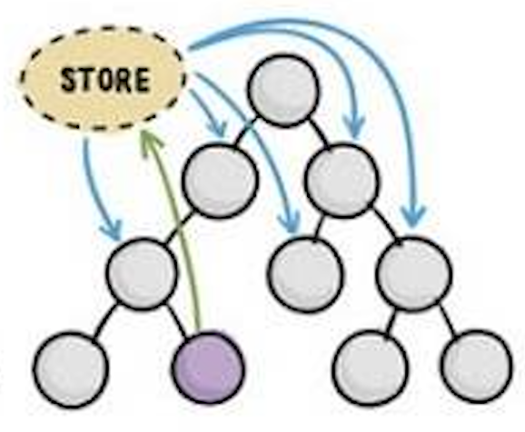

# redux基本原则

## 单一数据源

整个应用的 state 被储存在一棵 object tree 中，并且这个 object tree 只存在于唯一一个 store 中。

如图所示，无论你有多少个页面，还是有多少个组件，所有的状态都在一个单一的store中

## State 是只读的

>   我们不能直接修改state，而是返回一个新的state状态

唯一改变 state 的方法就是触发 action，action 是一个用于描述已发生事件的普通对象。

定义action
```
export interface AdminAction {
    type: AdminType,
    data?: any
}

```

通过action改变state

```
export const doLogin = (dispatch: Dispatch, admin: any) => {
    dispatch({type: AdminType.LOGIN, data: {admin, loading: false}})
}


```


##  使用纯函数来执行修改


```
const admin = (state: AdminState = initAdminState, action: AdminAction): AdminState => {
    switch (action.type) {
        case AdminType.LOADING:
            return {...state, ...action.data}
        case AdminType.GET:
            return {...state}
        case AdminType.SET:
            return {...state, ...action.data}
        case AdminType.LOGIN:
            return {...state, ...action.data}
        default:
            return state
    }
}

```